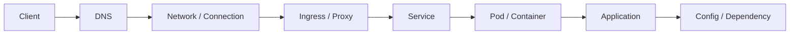
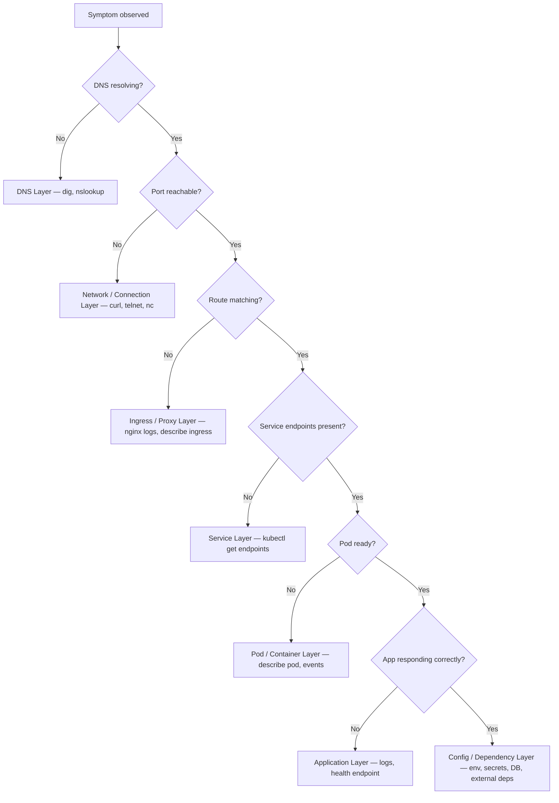

# Month 1 — Platform Foundation

> **Mission:** Move from operator to architect — build the mental model, diagnostic discipline, and hands-on fluency that lets you own a production platform end-to-end.

By the end of this month you will be able to:

- Trace any production failure from symptom to root cause through a layered model, not by guessing
- Design and operate Kubernetes workloads with confidence at every layer: DNS → Network → Ingress → Service → Pod → Application → Config
- Give a clear, evidence-driven explanation of what broke, why, and what prevents recurrence

---

## How to Use This Repo

| Folder | Purpose | Cadence |
|---|---|---|
| `daily-notes/` | Raw class notes, key insights, your own words — written same day | Every session |
| `docs/` | Polished reference material you'll return to (layer table, runbooks) | Built and refined over the month |
| `assessments/` | Honest self-scores against concrete skill targets | Baseline now; re-score every 2 weeks |
| `doubts/` | Precise questions that expose real gaps — not vague, never generic | Add any time; review weekly |
| `diagrams/` | Architecture diagrams, flow maps, anything visual | As needed |
| `app/` | Sample application code for hands-on exercises | Per exercise |
| `k8s/` | Kubernetes manifests — deployments, services, ingress, configs | Per exercise |

**Workflow per session:**

1. Open `daily-notes/dayN-classN.md` — answer the 5 mandated questions before closing the laptop
2. Any confusion or gap → drop it in `doubts/dayN-doubts.md` with enough context to answer later
3. When you learn something reusable → promote it to `docs/`
4. At the 2-week mark → re-score `assessments/baseline-self-assessment.md` and note what shifted

---

## The 8-Layer Troubleshooting Stack

Every production problem lives at exactly one layer. Your job is to **narrow to it**, not guess at it.

| # | Layer | Failure Symptoms | First Tool |
|---|---|---|---|
| 1 | **Client** | Wrong URL, no request ever sent, CORS error in browser, client-side timeout | Browser devtools, `curl -v`, check URL/headers |
| 2 | **DNS** | `Could not resolve host`, `NXDOMAIN`, stale IP after deploy, service not found inside cluster | `dig`, `nslookup`, `kubectl exec -- nslookup <svc>` |
| 3 | **Network / Connection** | `Connection refused`, `Connection timed out`, TCP SYN never ACKed, firewall drop | `curl`, `telnet`, `nc -zv`, check Security Groups / NetworkPolicy |
| 4 | **Ingress / Proxy / Route** | `404` (no matching route), `502` (upstream down), `503` (no healthy upstream), path/host mismatch | `kubectl describe ingress`, nginx error logs, check annotations |
| 5 | **Service** | `curl` to ClusterIP works but pod unreachable, empty Endpoints list | `kubectl get endpoints <svc>`, check selector labels match pod labels |
| 6 | **Pod / Container** | `CrashLoopBackOff`, `OOMKilled`, failing probes, not-Ready, image pull error | `kubectl describe pod`, `kubectl logs`, check events |
| 7 | **Application** | `500 Internal Server Error`, `504 Gateway Timeout`, panic in logs, wrong business logic | Application logs (`kubectl logs`), `/health` or `/ready` endpoint, traces |
| 8 | **Config / Dependency** | App starts but DB unreachable, missing env var, wrong secret value, external API 401/403 | `kubectl exec -- env`, describe ConfigMap/Secret, check DB connection pool |

### Request Flow — Where Each Layer Sits

### The Narrowing Decision Tree

When a request fails, walk this tree — stop at the first `No`:

For the full layer reference — including concrete HTTP error codes, failure patterns per layer, and tool cheatsheet — see [`docs/system-layers.md`](docs/system-layers.md).

---

## Self-Assessment

Start with [`assessments/baseline-self-assessment.md`](assessments/baseline-self-assessment.md). Score yourself honestly across 12 skills before reviewing any material. Re-score at the 2-week mark and end of month. The goal is not a high score now — it is an accurate one that tells you where to spend energy.
