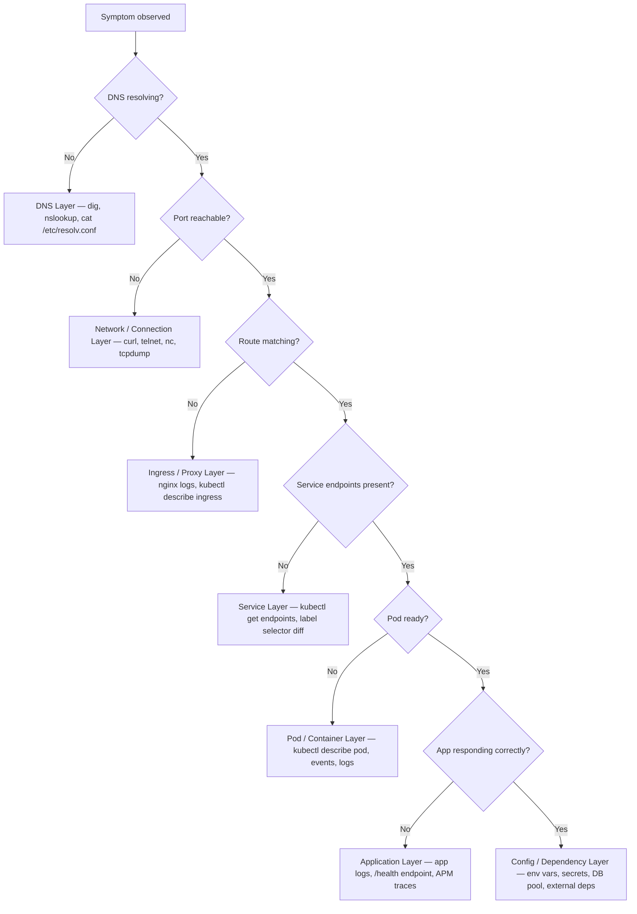
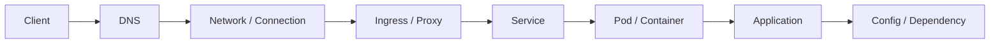

# System Layers — Layered Troubleshooting Reference

> Every production failure lives at exactly one layer. The discipline is **narrowing**, not guessing.
> Start at Layer 1 (Client). Stop at the first layer where evidence breaks down. That is your root cause layer.

---

## Narrowing Decision Tree

Walk this tree top-to-bottom. Stop at the first **No** — that is your active layer.



---

## Request Flow — Layer Position in the Call Path



---

## Layer Reference Table

| # | Layer | What it is | Failure Symptoms | HTTP Codes | First Tool |
|---|-------|------------|-----------------|-----------|------------|
| 1 | **Client** | The originating request sender — browser, curl, SDK, service mesh sidecar | Wrong URL, missing headers, CORS error in browser, client-side timeout before server sees request | N/A (never reaches server) | Browser devtools Network tab, `curl -v`, inspect request headers |
| 2 | **DNS** | Name resolution — translates hostnames to IPs (CoreDNS inside cluster, upstream resolver outside) | `Could not resolve host`, `NXDOMAIN`, stale IP after deploy, service not found by name | N/A (connection never starts) | `dig <host>`, `nslookup <host>`, inside cluster: `kubectl exec -- nslookup <svc>.<ns>.svc.cluster.local` |
| 3 | **Network / Connection** | TCP/IP layer — packets routing, firewall rules, Security Groups, NetworkPolicy, port bindings | `Connection refused` (no listener), `Connection timed out` (firewall drop or wrong IP), TCP SYN without ACK | N/A (HTTP never begins) | `curl -v`, `nc -zv <host> <port>`, `telnet <host> <port>`, `tcpdump`, check SG / NetworkPolicy |
| 4 | **Ingress / Proxy / Route** | Layer 7 reverse proxy — host/path matching, TLS termination, upstream routing (nginx, Envoy, Traefik) | `404` (no matching route), `502` (upstream down or refusing), `503` (no healthy upstream registered), `413` (body too large), path/host mismatch | 404, 502, 503, 413, 301/302 loops | `kubectl describe ingress`, nginx controller logs, `kubectl logs -n ingress-nginx deploy/ingress-nginx-controller` |
| 5 | **Service** | Kubernetes virtual load balancer — ClusterIP, NodePort, LoadBalancer; selects pods via label selectors; kube-proxy maintains iptables/IPVS rules | `curl` to ClusterIP works but pod unreachable, empty Endpoints list, traffic going to wrong pods | 502/503 from upstream proxy | `kubectl get endpoints <svc>`, compare `kubectl get svc -o yaml` selector vs `kubectl get pods --show-labels` |
| 6 | **Pod / Container** | The running workload unit — OCI container inside a Kubernetes pod; subject to resource limits, probes, image pull | `CrashLoopBackOff`, `OOMKilled`, `ImagePullBackOff`, `ErrImagePull`, failing readiness probe removes pod from endpoints, not-Ready | 502/503 (proxy can't reach it) | `kubectl describe pod <name>`, `kubectl logs <pod>`, `kubectl logs <pod> --previous`, check events section |
| 7 | **Application** | Code running inside the container — business logic, frameworks, request handlers, internal error handling | `500 Internal Server Error`, `504 Gateway Timeout` (app slow to respond), panic/exception in logs, wrong response body, silent data corruption | 500, 502 (crash), 504 (timeout) | `kubectl logs <pod>` (structured logs, stack traces), `/health` or `/ready` HTTP endpoint, APM traces |
| 8 | **Config / Dependency** | Runtime configuration and external dependencies — env vars, Secrets, ConfigMaps, database connections, external APIs, message queues | App starts but cannot connect to DB (`connection refused`, `connection pool exhausted`), missing env var causes panic on startup, wrong secret value causes 401/403 to downstream | 500 (app error), 503 (dep unavailable) | `kubectl exec <pod> -- env`, `kubectl describe configmap`, `kubectl get secret -o yaml`, check DB connection pool metrics |

---

## Layer 1 — Client

**What it is:**
The origin of the HTTP request. Can be a browser, `curl`, a service making an outbound call, or a service mesh sidecar proxy. Failures here mean the request is malformed or never sent correctly — the server never sees a well-formed request.

**How failure manifests:**
- CORS preflight rejected (browser blocks before sending actual request)
- Wrong protocol (HTTP vs HTTPS)
- Incorrect `Host` header
- Client-side timeout fires before server responds (client gives up, server processes the request and wastes resources)
- Certificate validation failure on the client side (`SSL_ERROR_RX_RECORD_TOO_LONG`, expired cert)

**First tool:** Browser DevTools → Network tab, `curl -v`, inspect request shape

**Knowledge graph:**
- `client sends_to dns`
- `client has_headers request_headers`
- `client timeout causes incomplete_request`

---

## Layer 2 — DNS

**What it is:**
The system that translates a hostname (`api.example.com`, `my-svc.default.svc.cluster.local`) into an IP address. Inside a Kubernetes cluster, DNS is served by **CoreDNS**. Every pod gets a `resolv.conf` pointing to the CoreDNS ClusterIP. Outside the cluster, resolution goes through the upstream resolver chain.

**How failure manifests:**
- `curl: (6) Could not resolve host: api.example.com`
- `NXDOMAIN` — name does not exist at all
- Stale IP returned after a service failover (TTL caching, client-side resolver caching)
- Inside cluster: short hostname fails (`db`) because `ndots: 5` and the search domain list doesn't include the right namespace suffix

**Key concept — ndots and search domains:**
When `ndots: 5` (Kubernetes default) and a query has fewer than 5 dots, the resolver appends each search domain before trying the name as-is. `db` → tries `db.default.svc.cluster.local`, then `db.svc.cluster.local`, then `db.cluster.local`, then `db` (bare). This causes N+1 DNS queries and can cause lookup latency under load.

**First tool:** `dig`, `nslookup`, inside pod: `cat /etc/resolv.conf`, `kubectl exec -- nslookup svc-name.namespace.svc.cluster.local`

**Commands:**
```bash
# Outside cluster
dig api.example.com
nslookup api.example.com

# Inside pod — full FQDN to bypass ndots overhead
kubectl exec -it <pod> -- nslookup my-svc.my-namespace.svc.cluster.local

# Check pod's resolver config
kubectl exec -it <pod> -- cat /etc/resolv.conf

# Check CoreDNS is running
kubectl get pods -n kube-system -l k8s-app=kube-dns

# Check CoreDNS logs for query failures
kubectl logs -n kube-system -l k8s-app=kube-dns
```

**Knowledge graph:**
- `dns resolves_to ip`
- `coredns serves cluster_dns`
- `pod resolv_conf points_to coredns`
- `ndots interacts_with search_domains`
- `dns_ttl causes stale_routing`

---

## Layer 3 — Network / Connection

**What it is:**
The TCP/IP layer. After DNS resolves the IP, the client attempts a TCP connection. This layer handles routing, firewall rules (iptables, Security Groups, NetworkPolicy), port bindings, and NAT. A failure here means the IP is known but the TCP handshake cannot complete.

**How failure manifests:**
- `Connection refused` — something is listening at the IP but not on that port (or app not binding to the right interface — `127.0.0.1` vs `0.0.0.0`)
- `Connection timed out` — firewall/Security Group is dropping the SYN silently; no RST sent back
- `No route to host` — routing table has no path to that IP
- Pod-to-pod blocked by NetworkPolicy

**Connection refused vs timed out distinction:**
| Signal | Cause |
|--------|-------|
| `Connection refused` (immediate RST) | Process exists, port not open — or app binding to wrong interface |
| `Connection timed out` (hangs for ~30s) | Firewall dropping SYN; no RST returned |

**First tool:** `curl -v`, `nc -zv <host> <port>`, check Security Groups / NetworkPolicy

**Commands:**
```bash
# TCP reachability test
nc -zv <host> <port>
curl -v --connect-timeout 5 http://<host>:<port>/

# Check what is listening inside a container
kubectl exec -it <pod> -- ss -tlnp

# Capture packets on bridge/veth
tcpdump -i eth0 -n 'port 8080'

# Check NetworkPolicy
kubectl get networkpolicy -n <namespace>
kubectl describe networkpolicy <name>
```

**Knowledge graph:**
- `network_layer sits_between dns and ingress`
- `firewall blocks tcp_syn`
- `networkpolicy controls pod_to_pod_traffic`
- `connection_refused indicates wrong_binding`
- `connection_timeout indicates firewall_drop`

---

## Layer 4 — Ingress / Proxy / Route

**What it is:**
The Layer 7 reverse proxy that receives HTTP requests and routes them to the correct backend Service. In Kubernetes, this is typically the **nginx Ingress controller**, Envoy (Istio / Gateway API), or Traefik. It handles: host-based routing, path-based routing, TLS termination, rate limiting, authentication, and traffic shaping.

**How failure manifests:**
- `404` — no `server`/`location` block matches the Host header + path combination
- `502 Bad Gateway` — nginx connected to the upstream (pod/service) but the upstream returned a bad response, or the connection was refused
- `503 Service Unavailable` — nginx has no healthy upstream to route to (empty endpoints, all backends failing health checks)
- `413 Request Entity Too Large` — default nginx body size limit exceeded (tune with `proxy-body-size` annotation)
- `504 Gateway Timeout` — upstream connected but did not respond within `proxy-read-timeout`

**502 vs 503 vs 504 from nginx:**
| Code | nginx meaning |
|------|--------------|
| 502 | Upstream returned invalid response or closed connection immediately |
| 503 | No upstream available (all marked down, no endpoints) |
| 504 | Upstream connected but response took longer than timeout |

**First tool:** `kubectl describe ingress`, nginx controller logs

**Commands:**
```bash
# Describe the Ingress resource
kubectl describe ingress <name> -n <namespace>

# Nginx controller logs (where 502/503/504 details live)
kubectl logs -n ingress-nginx deploy/ingress-nginx-controller -f

# Check generated nginx.conf inside controller
kubectl exec -n ingress-nginx deploy/ingress-nginx-controller -- cat /etc/nginx/nginx.conf

# Check IngressClass
kubectl get ingressclass
```

**Knowledge graph:**
- `ingress routes_to service`
- `ingress terminates_tls`
- `ingress_controller reads ingress_resources`
- `502 indicates upstream_down`
- `503 indicates no_endpoints`
- `504 indicates upstream_timeout`
- `path_matching_precedence determines route_selection`

---

## Layer 5 — Service

**What it is:**
A Kubernetes abstraction providing a stable virtual IP (ClusterIP) and DNS name for a set of pods. The Service **does not forward packets itself** — `kube-proxy` maintains iptables/IPVS rules that DNAT traffic from the ClusterIP to one of the backing pod IPs. The set of backing pods is determined by the Service's **label selector**.

**How failure manifests:**
- Traffic reaches the Service ClusterIP but gets no response → `kubectl get endpoints` shows empty list
- Some traffic hits wrong pods → label selector matches unintended pods (e.g., matching both v1 and v2 during deployment)
- Service exists, DNS resolves, but no pods are Ready → endpoint list is empty even though pods exist (readiness probe failing)

**Why endpoints are empty — the two causes:**
1. **Label mismatch** — Service `spec.selector` does not match any pod labels
2. **No ready pods** — pods exist but all are failing readiness probes → removed from endpoint slice

**First tool:** `kubectl get endpoints <svc>`

**Commands:**
```bash
# See what IPs back the service
kubectl get endpoints <svc> -n <namespace>

# Compare service selector vs pod labels
kubectl get svc <svc> -o jsonpath='{.spec.selector}'
kubectl get pods -n <namespace> --show-labels

# Trace iptables rules for a ClusterIP (on a node)
iptables-save | grep <cluster-ip>

# Check kube-proxy mode
kubectl get configmap kube-proxy -n kube-system -o yaml | grep mode
```

**Knowledge graph:**
- `service selects pods`
- `service has_virtual_ip clusterip`
- `kube-proxy maintains iptables_rules`
- `label_selector determines endpoints`
- `readiness_probe affects endpoints`
- `endpoints populated_from ready_pods`

---

## Layer 6 — Pod / Container

**What it is:**
The running workload unit. A Pod is one or more containers sharing a network namespace and storage. Containers run OCI images, are subject to resource limits (CPU/memory), and are governed by probes (liveness, readiness, startup). This is where the process actually executes.

**How failure manifests:**
- `CrashLoopBackOff` — container starts, crashes, kubelet backs off restarts exponentially
- `OOMKilled` — container exceeded its memory limit; kernel OOM killer terminated the process
- `ImagePullBackOff` / `ErrImagePull` — registry unreachable, wrong tag, missing pull secret
- `Pending` — pod cannot be scheduled (insufficient resources, no matching node, taint/toleration mismatch)
- Pod running but not Ready — readiness probe failing; pod exists but receives no Service traffic
- `Init:CrashLoopBackOff` — an initContainer is failing before main container starts

**CrashLoopBackOff vs OOMKilled distinction:**
| State | Cause |
|-------|-------|
| `CrashLoopBackOff` | Process exits non-zero (any reason) — check logs for panic/error |
| `OOMKilled` | Process exceeded memory limit — `kubectl describe pod` shows `OOMKilled` in last state |

**First tool:** `kubectl describe pod <name>`, `kubectl logs <pod>`

**Commands:**
```bash
# Full pod state including events and probe results
kubectl describe pod <name> -n <namespace>

# Current logs
kubectl logs <pod> -n <namespace>

# Logs from previous crash
kubectl logs <pod> -n <namespace> --previous

# Resource usage
kubectl top pod <pod> -n <namespace>

# Shell into running container
kubectl exec -it <pod> -n <namespace> -- /bin/sh

# Check all pods with their status
kubectl get pods -n <namespace> -o wide
```

**Knowledge graph:**
- `pod runs containers`
- `pod subject_to resource_limits`
- `liveness_probe triggers restart`
- `readiness_probe affects endpoints`
- `startup_probe gates liveness_and_readiness`
- `crashloopbackoff indicates process_exit`
- `oomkilled indicates memory_limit_exceeded`
- `imagepullbackoff indicates registry_unreachable`

---

## Layer 7 — Application

**What it is:**
The business logic running inside the container. This layer owns: request handling, response generation, internal error recovery, internal health-check endpoints, and application-level timeouts. Failures here are code-level: exceptions, panics, deadlocks, slow queries, infinite loops, or logic errors.

**How failure manifests:**
- `500 Internal Server Error` — unhandled exception in request handler
- `504 Gateway Timeout` — application connected to a downstream (DB, API) but the response took longer than the proxy's timeout
- Stack traces / panics in application logs
- `/health` or `/ready` endpoint returning non-200
- Correct HTTP 200 but wrong response body (silent logic error — hardest to catch without contract testing)

**504 chain — who times out first:**
```
Client timeout > Ingress proxy-read-timeout > App request timeout > DB query timeout
```
The first timeout to fire wins. A 504 from nginx means nginx gave up waiting for the app — the app may still be processing.

**First tool:** `kubectl logs <pod>`, application `/health` endpoint, APM trace (Jaeger, Datadog, Honeycomb)

**Commands:**
```bash
# Stream application logs
kubectl logs -f <pod> -n <namespace>

# Check health endpoint directly from inside the cluster
kubectl exec -it <pod> -- curl -s http://localhost:8080/health

# Tail logs across all pods of a deployment
kubectl logs -l app=<label> -n <namespace> --tail=100 -f
```

**Knowledge graph:**
- `application runs_in pod`
- `application depends_on config_layer`
- `500 indicates application_error`
- `504 indicates application_timeout`
- `health_endpoint reflects application_state`
- `apm_trace reveals internal_latency`

---

## Layer 8 — Config / Dependency

**What it is:**
The runtime environment the application depends on to function correctly: environment variables, Secrets, ConfigMaps, database connections, external APIs, message queues, caches. The application process may start successfully but fail at this layer when it tries to use a misconfigured or unreachable resource.

**How failure manifests:**
- App starts, then crashes on first request because a required env var is missing (`panic: DATABASE_URL not set`)
- App runs but returns 500 on every request because DB connection pool is exhausted
- Correct env vars set but pointing to wrong endpoint (staging DB in production)
- External API returns 401/403 because the secret value is stale or wrong
- ConfigMap updated but pod not restarted — app is using the old in-memory value

**ConfigMap hot-reload caveat:**
Updating a ConfigMap does **not** automatically restart pods. The app must either watch the file for changes (if mounted as a volume) or the pod must be restarted. Secret volume mounts do update eventually via kubelet sync (~1 minute), but env-var-sourced values never update without a restart.

**First tool:** `kubectl exec <pod> -- env`, `kubectl describe configmap`, `kubectl get secret`

**Commands:**
```bash
# Inspect all env vars in the running container
kubectl exec -it <pod> -- env | sort

# Read ConfigMap content
kubectl get configmap <name> -n <namespace> -o yaml

# Read Secret (base64-encoded values)
kubectl get secret <name> -n <namespace> -o yaml
# Decode a specific key
kubectl get secret <name> -o jsonpath='{.data.password}' | base64 -d

# Test DB connectivity from inside the pod
kubectl exec -it <pod> -- nc -zv <db-host> 5432
kubectl exec -it <pod> -- curl -s http://<external-api>/health
```

**Knowledge graph:**
- `config_layer feeds application`
- `configmap mounts_as env_or_volume`
- `secret stores sensitive_config`
- `database is external_dependency`
- `missing_env_var causes startup_panic`
- `stale_secret causes auth_failure`
- `connection_pool_exhaustion causes 503`

---

## Master Relationship Map

```
client sends_request_to dns
dns resolves_to ip
ip connects_via network
network reaches ingress
ingress routes_to service
service selects pods
pod runs application
application depends_on config
application depends_on external_dependencies

readiness_probe affects service_endpoints
liveness_probe triggers pod_restart
startup_probe gates liveness_and_readiness_checks

label_selector maps service_to_pods
kube-proxy maintains iptables_for_service

tls terminates_at ingress
ingress reads ingressclass
ingressclass selects ingress_controller

coredns serves cluster_dns_queries
ndots interacts_with search_domains
```

---

## Quick-Symptom → Layer Lookup

| Symptom | Start here |
|---------|-----------|
| `Could not resolve host` | Layer 2 — DNS |
| `Connection refused` | Layer 3 — Network (check app binding) |
| `Connection timed out` | Layer 3 — Network (check firewall / SG) |
| `404 Not Found` from proxy | Layer 4 — Ingress (no matching route) |
| `502 Bad Gateway` | Layer 4 → Layer 6 (upstream refusing or crashed) |
| `503 Service Unavailable` | Layer 4 → Layer 5 (no healthy endpoints) |
| `504 Gateway Timeout` | Layer 4 → Layer 7 (app slow / DB blocking) |
| `500 Internal Server Error` | Layer 7 — Application |
| Pod not receiving traffic (but running) | Layer 5 → Layer 6 (endpoints empty / readiness failing) |
| `CrashLoopBackOff` | Layer 6 — Pod (process crashing) |
| `OOMKilled` | Layer 6 — Pod (memory limit) |
| App starts but immediately errors | Layer 8 — Config / missing env var / bad secret |
| DB connection pool exhausted | Layer 8 — Config / Dependency |
| Auth failure to external API | Layer 8 — Config (wrong/stale secret) |
